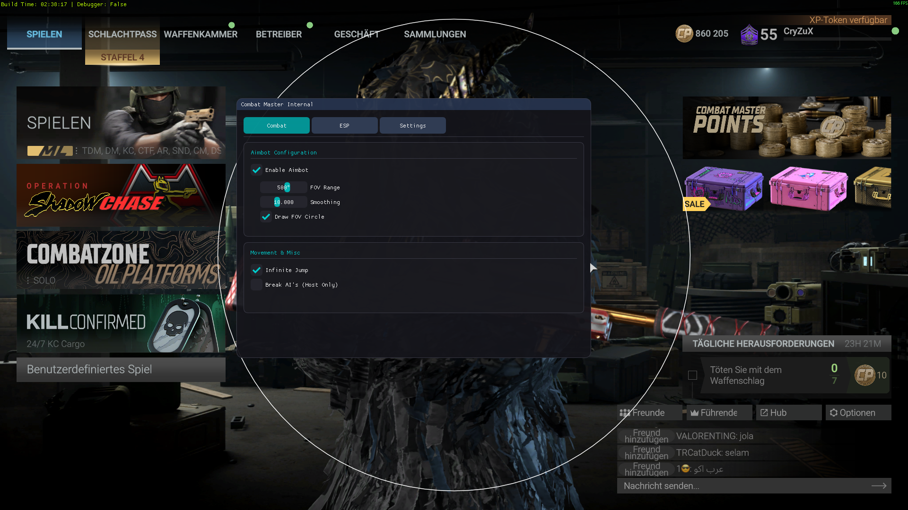

# Project Name

> *An internal cheat base for Combat Master with basic ESP and Aimbot.*

## Table of Contents

- [Overview](#overview)  
- [Installation](#installation)   
- [Contributing](#contributing)  

---

## Overview

This is a simple internal cheat for the Unity game Combat Master, it has a basic SDK
with information gathered reversing the game itself and Unity Engine.

It contains the following basic features (Open to contribution)

- ESP (Snaplines + Text)
- Aimbot with adjustable smoothing
- Watermark
- Break AI Pathfinding
- Debug Logger

- Press `Insert` to toggle the menu.  
- Toggleboxes and buttons are used to activate features

I made this project for fun, others may learn something from it, or even use it as a base to make their own cheat for this game. I thought it would be a fun little project, the SDK included allows you to easily add things from various other classes i haven't reversed yet along with other unknown types making it easily expandable.

---

## Contributing

Feel free to contribute in any way.

TODO

- Add correct parsing of Unity Engine transform class instances to correctly extract the transforms position via indicies
- Distinguish players by team ID (Look at GetTeamID() function in older unobfuscated metadata game builds)
- Adjust aimbot to correct height with player positions from head transform
- Identify player names, health, other fields, etc.. (Reversed from PlayerRoot)

---
## Installation

1. Build the DLL using the provided solution/project file in Visual Studio.  
2. Inject the DLL into the running game process using any DLL injector tool.  

---

## Gameplay

